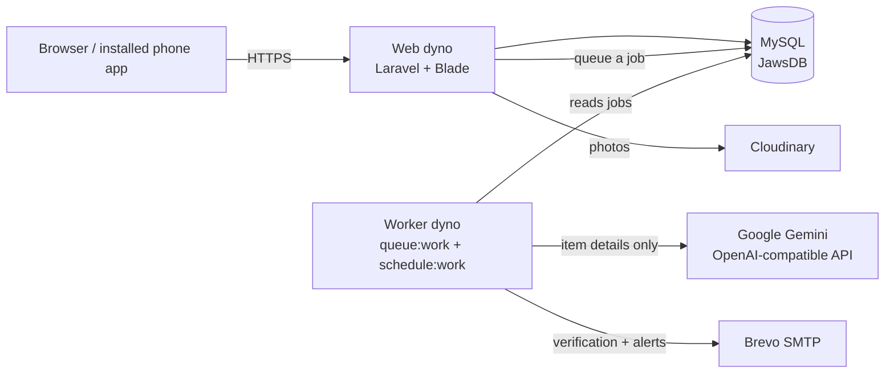
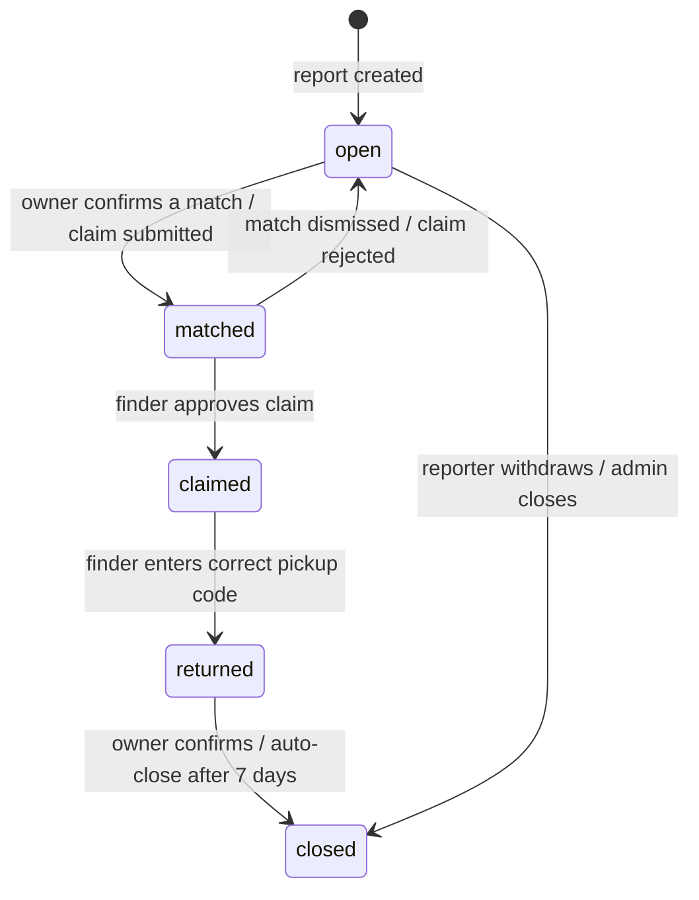
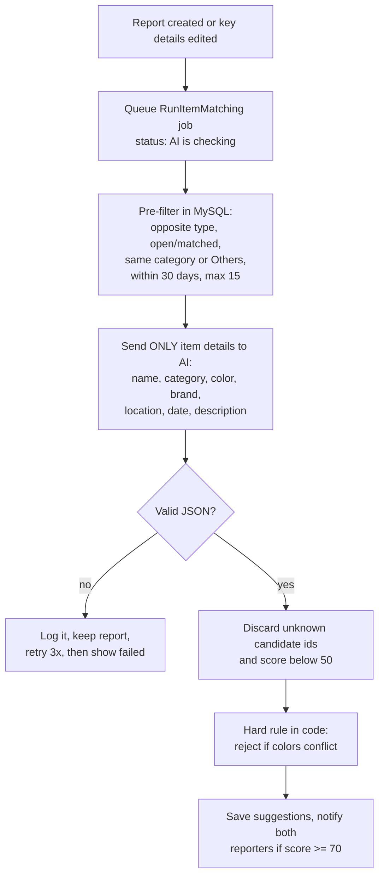
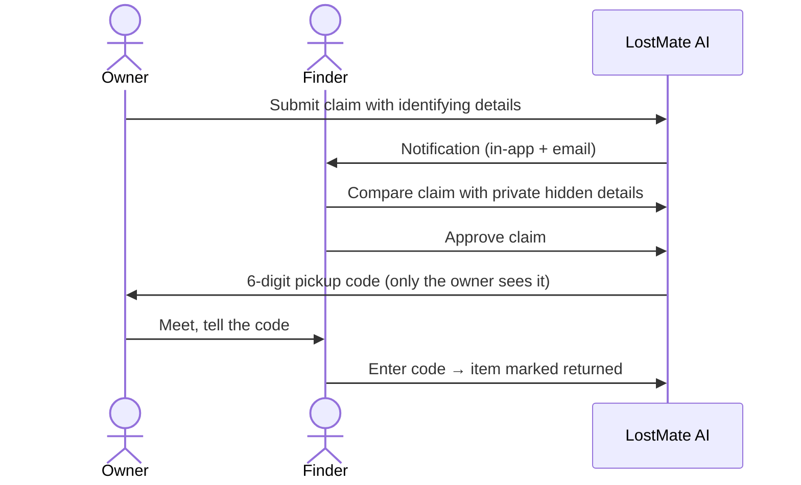

# LostMate AI — System Overview

A web-based lost and found system for a school. Students and staff report
lost or found items, get AI-suggested matches, message each other, and
claim items through a verified handover. Admins moderate everything.

Live: https://lostmate-ai-1d9097a9c75b.herokuapp.com

## 1. Architecture

| Layer | Technology | Where in the code |
|---|---|---|
| Backend | PHP, Laravel (MVC, Eloquent) | `app/` |
| Frontend | Blade, Bootstrap 5, vanilla JS | `resources/views`, `resources/js` |
| Database | MySQL, migrations + seeders | `database/` |
| Background work | Database queue + scheduler | `app/Jobs`, `routes/console.php`, `Procfile` |
| AI matching | Any OpenAI-compatible API (Gemini, OpenAI, Ollama) | `app/Services/MatchingService.php` |
| Photos | Local disk or Cloudinary | `app/Services/PhotoStorage.php` |

**Why a queue?** AI calls and emails can take seconds or fail. They run in
the background, so saving a report is always instant and never fails
because the AI or email service is down.

## 2. Item status flow

All status rules live in one place: `app/Services/ItemStatusService.php`.
Any transition not shown here is rejected.

When a found item becomes **returned**, its linked lost item becomes
returned too.

## 3. AI matching pipeline

- AI results are **suggestions only**. Ownership is always confirmed by
  people (claim + hidden details + pickup code).
- Never sent to the AI: hidden details, names, emails, phone numbers.
- Optional, off by default: the first photo of each report
  (`AI_MATCHING_PHOTOS=true`).
- Admins see failures on the dashboard's **System health** card and can
  retry them.

## 4. Claim and handover

The pickup code is calculated from the claim id and the app's secret key
(HMAC), so it is never stored and cannot be guessed. Items handed to the
school office follow the same flow, with office staff acting as finder.

## 5. Security and privacy

| Risk | Protection |
|---|---|
| Someone claims an item that isn't theirs | Hidden details only the finder sees; claimant must describe them; pickup code at handover |
| Personal data exposure | Email and phone never shown publicly; communication only through in-app messages; public profiles show only name, photo, school info |
| Unauthorized actions | Laravel Policies on every action; admin middleware; every admin action logged to `admin_logs` |
| Fake or outside accounts | Email verification (signed, expiring links); optional school-domain restriction |
| Common web attacks | CSRF tokens, Form Request validation, rate limits on login/forms, CSV-injection protection in exports |
| Data Privacy Act of 2012 | Privacy notice page; users can edit or permanently delete their account and photos |
| Photo metadata | Photos are re-encoded in the browser before upload, removing GPS location |

## 6. Main modules

| Module | Key files |
|---|---|
| Reports (lost/found) | `LostItemController`, `FoundItemController`, `ItemImageService` |
| Browse and search | `BrowseController` (keyword, category, location, date range, status, sort) |
| AI matching | `MatchingService`, `RunItemMatching`, `MatchingStatus` |
| Messaging | `ConversationController` |
| Claims and handover | `ClaimService`, `ClaimController`, `Claim::pickupCode()` |
| Office custody and unclaimed policy | `OfficeCustodyService`, `Admin/OfficeController` (QR claim tags) |
| Profiles | `ProfileController`, `UserProfileController`, `AccountDeletionService` |
| Admin | `app/Http/Controllers/Admin/*` (users, reports, claims, categories, flags, exports, logs, system health) |

## 7. Testing

`php artisan test` runs 168 automated tests. Tests never touch the
network: AI, Cloudinary, and email are faked.

## 8. Deployment (Heroku)

| Process | Command (`Procfile`) | Purpose |
|---|---|---|
| `release` | `php artisan migrate --force` | Updates the database on every deploy |
| `web` | Apache serving `public/` | The website |
| `worker` | `queue:work` + `schedule:work` | AI matching, emails, hourly auto-close |

Add-ons and services: JawsDB MySQL, Cloudinary (photos), Brevo (email),
Google Gemini (AI). All secrets are Heroku config vars, never in Git.
